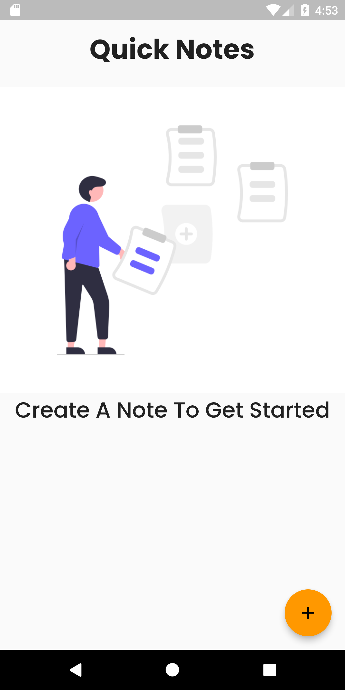
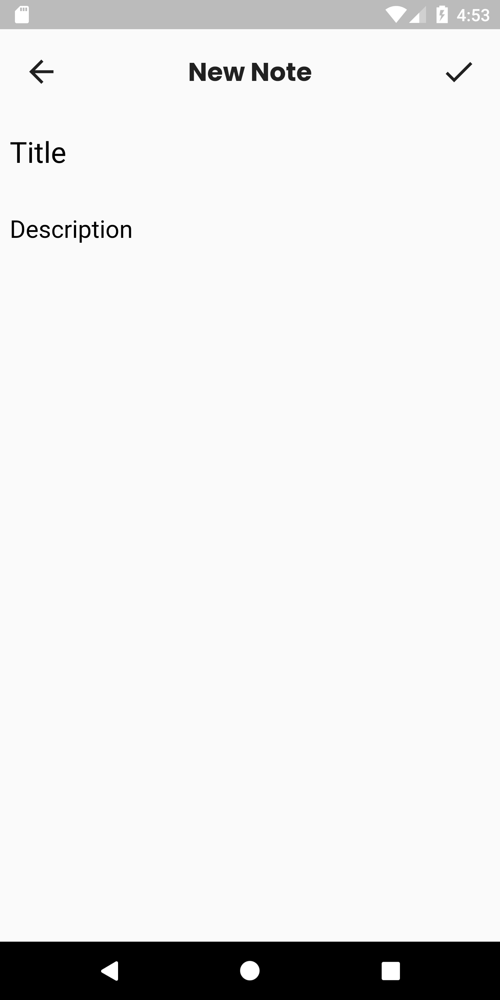
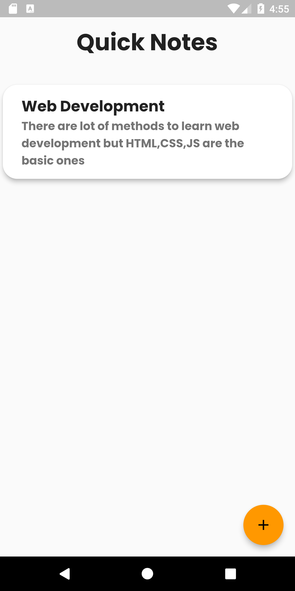
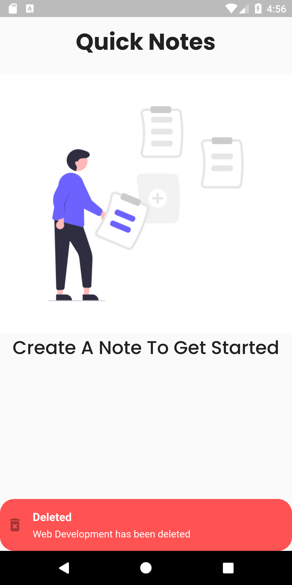

# Quick Notes App

A new Flutter project.

## Getting Started

This project is a starting point for a Flutter application.

## Used Libraries:
1. Google Fonts
2. Getx State Management
3. Get Storage

# Demo
## Home Page

## newNote

## Notes List

## Delete Notes

